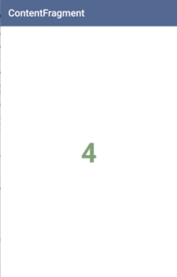
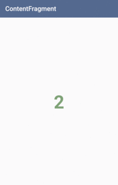
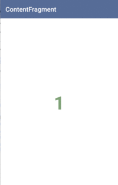

# VerticalViewPagerXamarin

Vertically ViewPager and vertically transformer for Android.
This library is not copy ViewPager code. Extended class.

Plugin is available on [Nuget](https://www.nuget.org/packages/Xam.Plugins.Android.VerticalViewPagerXamarin/)

  

# Support

* Feel free to open an issue. Make sure to use one of the templates!
* Commercial support is available. Integration with your app or services, samples, feature request, etc. Email: [hello@baseflow.com](mailto:hello@baseflow.com)
* Powered by: [baseflow.com](https://baseflow.com)

Documentation
=============

AXML

    <me.kaelaela.verticalviewpager.VerticalViewPager
        android:id="@+id/vertical_viewpager"
        android:layout_width="match_parent"
        android:layout_height="match_parent" />

C# code

    VerticalViewPager viewPager = FindViewById<VerticalViewPager>(Resource.Id.vertical_viewpager);
    string title = "ContentFragment";

    var adapter = new ContentFragmentAdapter (SupportFragmentManager, new List<Fragment> (){ 
        ContentFragment.NewInstance(title, 1),
        ContentFragment.NewInstance(title, 2),
        ContentFragment.NewInstance(title, 3),
        ContentFragment.NewInstance(title, 4),
        ContentFragment.NewInstance(title, 5)
    });

    viewPager.Adapter = adapter;

    //If you setting other scroll mode, the scrolled fade is shown from either side of display.
    viewPager.OverScrollMode = Android.Views.OverScrollMode.Never;

See the Sample app for more details.

Acknowledgements
=======

* [kaelaela](https://github.com/kaelaela) for creating the [library](https://github.com/kaelaela/VerticalViewPager)

License
-------
    Copyright (C) 2015 kaelaela
    Copyright (C) 2013 The Android Open Source Project

    Licensed under the Apache License, Version 2.0 (the "License");
    you may not use this file except in compliance with the License.
    You may obtain a copy of the License at

       http://www.apache.org/licenses/LICENSE-2.0

    Unless required by applicable law or agreed to in writing, software
    distributed under the License is distributed on an "AS IS" BASIS,
    WITHOUT WARRANTIES OR CONDITIONS OF ANY KIND, either express or implied.
    See the License for the specific language governing permissions and
    limitations under the License.
